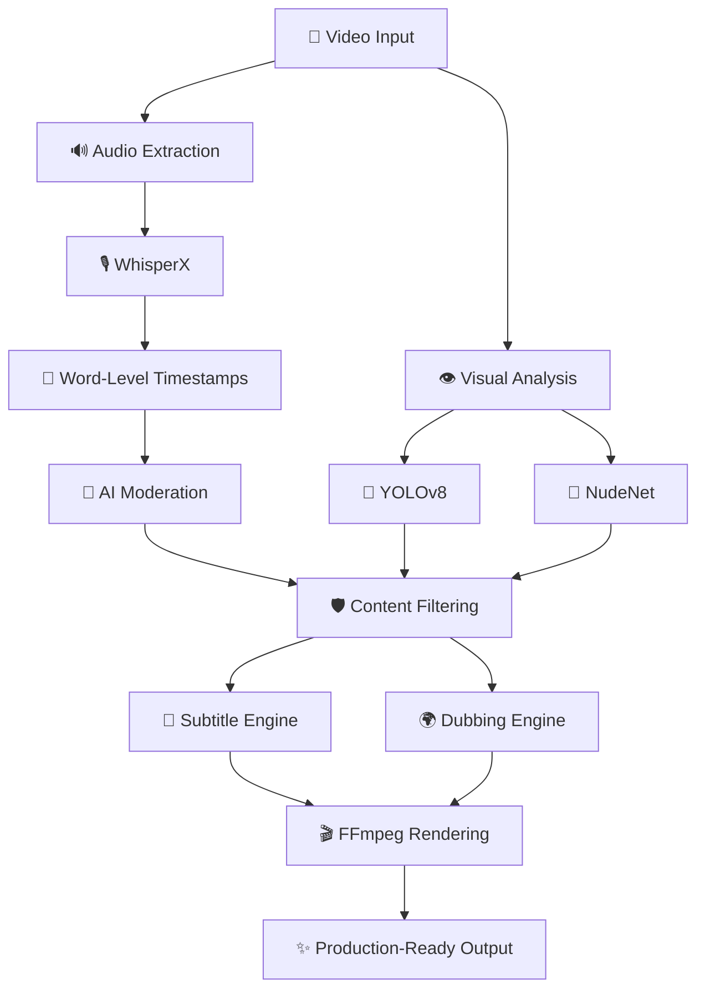

<div align="center">

# 🎬 EDITRA

### AI-Powered Multimodal Video Editing Platform

**Understand. Moderate. Transform. Render.**

<p>
  
  
  
  
  
  
</p>

<p>
  <a href="https://github.com/chandramouli9392/Editra-AI">
    
  </a>
  <a href="https://github.com/chandramouli9392/Editra-AI/network/members">
    
  </a>
  <a href="https://github.com/chandramouli9392/Editra-AI/issues">
    
  </a>
</p>

<br>


</div>

---

# 🚀 What is EDITRA?

> **Why spend hours editing content when AI can understand, moderate, transform, and render it automatically?**

**EDITRA** is an AI-powered multimodal video editing ecosystem designed to automate the most repetitive parts of modern video production.

Instead of treating a video as simply a sequence of frames, EDITRA analyzes multiple modalities:

```text
🎥 Video
   │
   ├── 🔊 Audio
   ├── 📝 Speech
   ├── 👁️ Visual Content
   ├── 🧠 Semantic Information
   └── 🌍 Language
          │
          ▼
      🤖 EDITRA
          │
          ▼
   🎬 Production-Ready Video
```

The platform combines:

* 🎙️ Speech Intelligence
* 👁️ Computer Vision
* 🤖 AI Content Moderation
* 📝 Automatic Subtitles
* 🌍 AI Dubbing
* 🎬 Automated Video Processing
* ⚡ FFmpeg Rendering
* 🎨 Quick-Look Color Processing

### The goal?

**Less Editing. More Creating.**

---

# ✨ Core Capabilities

<table>
<tr>
<td width="50%">

## 🎙️ Speech Intelligence

* AI Speech-to-Text
* Word-level timestamps
* Transcript generation
* Audio analysis
* Multi-language processing
* Subtitle generation

</td>

<td width="50%">

## 🤖 AI Moderation

* Profanity detection
* Automatic audio censoring
* Beep generation
* NSFW detection
* Sensitive content identification
* Safe-content rendering

</td>
</tr>

<tr>
<td>

## 👁️ Computer Vision

* Object detection
* Scene understanding
* Frame analysis
* Visual moderation
* Content filtering
* AI-powered video analysis

</td>

<td>

## 🎬 Smart Video Editing

* Automated editing
* Video transformations
* Rendering automation
* Export pipeline
* Processing optimization
* Quick-look presets

</td>
</tr>

<tr>
<td>

## 🌍 AI Dubbing

* Transcript processing
* Multilingual translation
* Speech generation
* Audio alignment
* Timestamp synchronization
* Dubbing workflow

</td>

<td>

## ⚡ Production Pipeline

* Automated processing
* FFmpeg integration
* Media transformation
* Parallel processing
* Output generation
* Production-ready exports

</td>
</tr>
</table>

---

# 🧠 How EDITRA Works



---

# 🏗️ System Architecture

```text
                         ┌─────────────────────┐
                         │    🎥 VIDEO INPUT   │
                         └──────────┬──────────┘
                                    │
                 ┌──────────────────┴──────────────────┐
                 │                                     │
                 ▼                                     ▼
        ┌─────────────────┐                   ┌─────────────────┐
        │  🔊 AUDIO       │                   │  👁️ VIDEO      │
        │  EXTRACTION     │                   │  ANALYSIS       │
        └────────┬────────┘                   └────────┬────────┘
                 │                                     │
                 ▼                                     ▼
        ┌─────────────────┐                   ┌─────────────────┐
        │   WhisperX      │                   │    YOLOv8       │
        │ Speech-to-Text  │                   │ Object Detection│
        └────────┬────────┘                   └────────┬────────┘
                 │                                     │
                 ▼                                     ▼
        ┌─────────────────┐                   ┌─────────────────┐
        │ Word-Level      │                   │ Scene / Frame   │
        │ Timestamps      │                   │ Understanding   │
        └────────┬────────┘                   └────────┬────────┘
                 │                                     │
                 └────────────────┬────────────────────┘
                                  │
                                  ▼
                     ┌────────────────────────┐
                     │ 🤖 AI MODERATION LAYER │
                     ├────────────────────────┤
                     │ • Profanity Detection  │
                     │ • NSFW Detection       │
                     │ • Sensitive Content    │
                     │ • Visual Filtering     │
                     └────────────┬───────────┘
                                  │
                   ┌──────────────┴──────────────┐
                   │                             │
                   ▼                             ▼
          ┌─────────────────┐           ┌─────────────────┐
          │ 📝 SUBTITLE     │           │ 🌍 AI DUBBING   │
          │ ENGINE          │           │ ENGINE          │
          └────────┬────────┘           └────────┬────────┘
                   │                             │
                   └──────────────┬──────────────┘
                                  │
                                  ▼
                     ┌────────────────────────┐
                     │ 🎬 FFmpeg RENDERING    │
                     └────────────┬───────────┘
                                  │
                                  ▼
                     ┌────────────────────────┐
                     │ ✨ FINAL VIDEO OUTPUT  │
                     └────────────────────────┘
```

---

# 🔥 Feature Pipeline

### 01 — Upload

```text
🎥 Raw Video
     ↓
📂 Video Ingestion
```

### 02 — Understand

```text
Audio ────────→ 🎙️ Speech Recognition
Video ────────→ 👁️ Computer Vision
Frames ───────→ 🎯 Object Detection
```

### 03 — Moderate

```text
Transcript ──→ 🚫 Profanity Detection
Frames ──────→ 🔞 NSFW Detection
Objects ─────→ ⚠️ Sensitive Content
```

### 04 — Transform

```text
📝 Subtitles
🌍 Dubbing
🔇 Audio Censoring
🎨 Color Processing
```

### 05 — Render

```text
Processed Assets
       ↓
    FFmpeg
       ↓
🎬 Final Production Video
```

---

# 🎙️ Speech Intelligence

EDITRA uses **WhisperX** to transform speech into structured, time-aligned information.

```text
Audio
  ↓
WhisperX
  ↓
Transcript
  ↓
Word-Level Alignment
  ↓
Timestamped Words
  ↓
Subtitle Generation
```

### Example

```json
{
  "word": "Welcome",
  "start": 0.52,
  "end": 0.91
}
```

This enables precise subtitle placement, content moderation, and synchronization.

---

# 🤖 AI Content Moderation

EDITRA doesn't simply process videos.

It **understands what is inside them**.

### Audio Moderation

```text
Speech
  ↓
Transcript
  ↓
Profanity Detection
  ↓
Sensitive Words
  ↓
Audio Beep / Censor
```

### Visual Moderation

```text
Video Frames
     ↓
Computer Vision
     ↓
NSFW Detection
     ↓
Sensitive Region Detection
     ↓
Moderation Decision
```

---

# 👁️ Computer Vision

EDITRA integrates computer vision models into the editing pipeline.

### Supported Components

| Technology      | Purpose                      |
| --------------- | ---------------------------- |
| 🎯 YOLOv8       | Object Detection             |
| 🔞 NudeNet      | NSFW Detection               |
| 🎥 OpenCV       | Video & Frame Processing     |
| 🧍 MediaPipe    | Visual / Landmark Processing |
| 🔥 PyTorch      | Deep Learning Infrastructure |
| 🤗 Transformers | NLP / AI Models              |

---

# 🌍 AI Dubbing

EDITRA is designed to support multilingual video transformation.

```text
Original Video
      ↓
Speech Recognition
      ↓
Transcript
      ↓
Language Processing
      ↓
Target Language
      ↓
Generated Speech
      ↓
Timestamp Alignment
      ↓
🎬 Dubbed Video
```

The architecture allows additional languages and speech models to be integrated into the pipeline.

---

# 📝 Automatic Subtitle Generation

```text
🎥 Video
  ↓
🔊 Audio
  ↓
🎙️ WhisperX
  ↓
📝 Transcript
  ↓
⏱️ Word-Level Alignment
  ↓
📄 Subtitle Generation
  ↓
🎬 FFmpeg
  ↓
✨ Subtitled Video
```

---

# 🎨 Quick-Look Color Processing

EDITRA also provides automated video processing workflows for rapid visual enhancement.

Example workflow:

```text
Original Video
      ↓
Color Processing
      ↓
Quick-Look Preset
      ↓
FFmpeg Processing
      ↓
Enhanced Video
```

The architecture can be extended with additional grading presets and transformation pipelines.

---

# ⚙️ Technology Stack

## 🐍 Backend

<p>

</p>

* Python
* FastAPI
* OpenCV
* FFmpeg

---

## 🤖 AI / ML

<p>

</p>

* WhisperX
* YOLOv8
* NudeNet
* MediaPipe
* PyTorch
* Hugging Face Transformers

---

## 🧠 AI Domains

```text
Artificial Intelligence
        │
        ├── 🤖 Generative AI
        ├── 👁️ Computer Vision
        ├── 🎙️ Speech Processing
        ├── 📝 NLP
        ├── 🔞 Content Moderation
        └── 🎬 Multimedia AI
```

---

# 📊 Processing Stack

| Layer               | Technologies              |
| ------------------- | ------------------------- |
| 🎥 Video Processing | FFmpeg, OpenCV            |
| 🎙️ Speech          | WhisperX                  |
| 👁️ Computer Vision | YOLOv8, OpenCV, MediaPipe |
| 🔞 Moderation       | NudeNet, NLP              |
| 🧠 Deep Learning    | PyTorch                   |
| 🤗 Transformers     | Hugging Face              |
| ⚡ Backend           | FastAPI                   |
| 🐍 Runtime          | Python                    |

---

# 🧩 Repository Structure

```text
EDITRA-AI/
│
├── 📁 backend/
│   ├── APIs
│   ├── AI pipelines
│   ├── video processing
│   └── moderation
│
├── 📁 frontend/
│   ├── UI
│   ├── components
│   └── video workflows
│
├── 📁 models/
│   ├── WhisperX
│   ├── YOLO
│   └── moderation models
│
├── 📁 processing/
│   ├── audio
│   ├── video
│   ├── subtitles
│   └── rendering
│
├── 📁 outputs/
│
├── 📄 README.md
└── 📄 requirements.txt
```

> Repository structure may evolve as new modules are integrated.

---

# 🚀 Key Features

| Feature                      | Status |
| ---------------------------- | :----: |
| 🎙️ Speech-to-Text           |    ✅   |
| ⏱️ Word-Level Timestamps     |    ✅   |
| 📝 Subtitle Generation       |    ✅   |
| 🚫 Profanity Detection       |    ✅   |
| 🔇 Audio Beep Censoring      |    ✅   |
| 🔞 NSFW Detection            |    ✅   |
| 🎯 Object Detection          |    ✅   |
| 👁️ Computer Vision Analysis |    ✅   |
| 🌍 AI Dubbing Workflow       |    ✅   |
| 🎬 FFmpeg Rendering          |    ✅   |
| 🎨 Quick-Look Processing     |    ✅   |
| ⚡ Automated Pipeline         |   🚧   |
| 🌐 Full Production Platform  |   🚧   |

---

# 🔮 Roadmap

```text
                    EDITRA ROADMAP

                         │
                         ▼

              ┌────────────────────┐
              │ ✅ Core AI Pipeline │
              └─────────┬──────────┘
                        │
                        ▼
              ┌────────────────────┐
              │ 🚧 Smart Editing   │
              └─────────┬──────────┘
                        │
                        ▼
              ┌────────────────────┐
              │ 🌍 Advanced Dubbing│
              └─────────┬──────────┘
                        │
                        ▼
              ┌────────────────────┐
              │ 🧠 AI Editor       │
              └─────────┬──────────┘
                        │
                        ▼
              ┌────────────────────┐
              │ ☁️ Scalable Cloud  │
              └─────────┬──────────┘
                        │
                        ▼
              ┌────────────────────┐
              │ 🚀 EDITRA Platform │
              └────────────────────┘
```

### Planned Improvements

* [ ] AI-powered scene segmentation
* [ ] Automatic highlight generation
* [ ] Intelligent jump cuts
* [ ] Advanced multilingual dubbing
* [ ] Speaker identification
* [ ] AI-generated B-roll suggestions
* [ ] Smart video summarization
* [ ] Cloud-based rendering
* [ ] GPU-accelerated processing
* [ ] Batch video processing
* [ ] Production monitoring
* [ ] Advanced editing automation

---

# ⚡ Why EDITRA?

Traditional editing workflow:

```text
Watch Video
     ↓
Find Mistakes
     ↓
Write Transcript
     ↓
Create Subtitles
     ↓
Remove Profanity
     ↓
Check Visual Content
     ↓
Add Effects
     ↓
Render
     ↓
Repeat
```

EDITRA:

```text
                 🎥 VIDEO
                    │
                    ▼
             ┌──────────────┐
             │    EDITRA    │
             │      AI      │
             └──────┬───────┘
                    │
       ┌────────────┼────────────┐
       ▼            ▼            ▼
    🎙️ Speech     👁️ Vision    🤖 AI
       │            │            │
       └────────────┼────────────┘
                    ▼
              🎬 AUTOMATION
                    │
                    ▼
             ✨ FINAL VIDEO
```

---

# 🧠 Design Philosophy

EDITRA follows an **AI-first multimedia processing philosophy**.

Instead of creating independent tools for every editing task, the platform connects multiple AI capabilities into a single processing pipeline.

```text
Understand
     ↓
Analyze
     ↓
Decide
     ↓
Transform
     ↓
Render
```

This architecture makes EDITRA extensible.

New AI models can be introduced as additional processing modules without redesigning the complete system.

---

# 📈 Future Vision

The long-term goal of EDITRA is to move from:

> **AI-assisted editing**

towards:

> **AI-directed editing**

Where users provide a simple instruction such as:

```text
"Create a 60-second social media video
from this 30-minute recording.

Remove profanity.
Add subtitles.
Translate to Hindi.
Generate a Hindi voice-over.
Remove unnecessary pauses.
Add quick color enhancement.
Export in 1080p."
```

And EDITRA orchestrates the complete workflow automatically.

```text
                 USER PROMPT
                      │
                      ▼
              🧠 AI ORCHESTRATOR
                      │
          ┌───────────┼───────────┐
          ▼           ▼           ▼
       Speech       Vision      NLP
          │           │           │
          └───────────┼───────────┘
                      ▼
                EDITING PLAN
                      │
                      ▼
                AI PIPELINE
                      │
                      ▼
                  FFmpeg
                      │
                      ▼
               🎬 FINAL VIDEO
```

---

# 🛠️ Project Status

🚧 **Actively Under Development**

EDITRA is continuously evolving with new:

* AI models
* Moderation capabilities
* Video processing modules
* Dubbing workflows
* Editing automation
* Rendering optimizations

---

# 👨‍💻 Author

<div align="center">

## Chandramouli Boppana

**AI Engineer • Generative AI Builder • Computer Vision Enthusiast**

Building intelligent systems where AI can **understand, transform, and enhance content at scale.**

<br>

<a href="https://github.com/chandramouli9392">

</a>

</div>

---

# ⭐ Support EDITRA

If you find EDITRA interesting:

⭐ **Star the repository**

🍴 **Fork the project**

🐛 **Report issues**

💡 **Suggest features**

🤝 **Contribute**

Every contribution helps make EDITRA better.

---

<div align="center">

### 🎬 EDITRA

**Less Editing. More Creating.**

<br>


</div>
